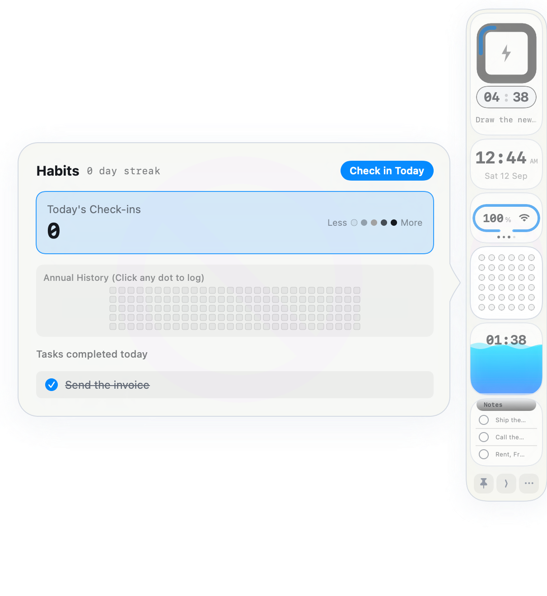

# SideDeck

**A compact, customizable utility dock that lives at the edge of your Mac.**

[](https://www.apple.com/macos/)
[](https://www.swift.org/)
[](LICENSE)

SideDeck keeps frequently used information and small actions within reach without filling the menu bar or competing with the macOS Dock. It attaches to the left or right edge of a display as a slim floating rail. Hover over a widget for a quick look, click it to keep its panel open, or collapse the entire rail to a small edge tab.

It is written in SwiftUI and AppKit, uses native macOS frameworks, and stores its data locally.



## Contents

- [What SideDeck does](#what-sidedeck-does)
- [How it behaves](#how-it-behaves)
- [Widgets](#widgets)
- [Customization](#customization)
- [Menu bar controls](#menu-bar-controls)
- [Privacy and local data](#privacy-and-local-data)
- [Installation](#installation)
- [Build from source](#build-from-source)
- [Architecture](#architecture)
- [Troubleshooting](#troubleshooting)
- [License](#license)

## What SideDeck does

SideDeck combines six small utilities in one persistent edge dock:

| Widget | At a glance | Open panel |
| --- | --- | --- |
| Focus | Current task and countdown | Start or pause the timer, select a task, add or delete tasks, mark tasks complete, clear completed tasks, and choose a 5, 15, or 25-minute timer |
| Clock | Local time and optional date | View the full date, time zone, and week number; follow the system clock or force 12/24-hour time; show or hide seconds and the date |
| Battery & Wi-Fi | Battery percentage, charge state, and Wi-Fi signal | View battery time estimates, the current network name and RSSI signal quality, toggle Wi-Fi power, and open macOS Wi-Fi settings |
| Habits | Recent activity grid | Check in once per calendar day, view the current streak and history, edit history cells, and see tasks completed today |
| Hydration | Animated water level and reminder countdown | Log 150 ml, 250 ml, or 500 ml, reset the current total, and review the 14-day drink chart |
| Notes | Recent checklist notes | Add, complete, reopen, and delete short notes with relative timestamps |

## How it behaves

SideDeck is designed to stay available without blocking the rest of the desktop.

- **Hover to preview:** Moving over a widget opens its panel. Moving between the rail and the panel keeps it open.
- **Click to hold:** Clicking a widget keeps that panel open while the pointer moves elsewhere. Click the same widget again to close it, or click another widget to switch.
- **Pin the rail:** Keep Dock Open prevents the rail itself from auto-collapsing.
- **Collapse to the edge:** The middle bottom control reduces SideDeck to a small tab. Hover over or click the tab to expand it again.
- **Choose either edge:** SideDeck can attach to the left or right side of the selected display.
- **Work across spaces:** The floating panel can appear across macOS Spaces and alongside full-screen apps.
- **Click-through outside SideDeck:** Transparent areas of the panel do not intercept clicks intended for the app underneath.

The three controls at the bottom of the rail are, from left to right: Keep Dock Open/Auto-collapse, Collapse to Edge, and Customize SideDeck.

## Widgets

### Focus and tasks

The Focus widget combines a countdown with a lightweight task list. Click the focus ring to start or pause the timer. Its panel provides 5, 15, and 25-minute presets and lets you add, select, complete, delete, or clear tasks. The selected pending task becomes the label on the compact card.

### Clock

The Clock widget follows the Mac's regional time format by default. Its panel can switch explicitly between 12-hour and 24-hour formats and independently control whether seconds and the date appear on the compact card.

### Battery and Wi-Fi

The status card reads battery information through macOS power-source APIs and displays Wi-Fi status using Apple's standard `wifi` SF Symbol. The expanded panel shows the connected SSID when macOS permits access, a plain-language signal rating, the RSSI value, battery/charging information, and a shortcut to Wi-Fi settings.

### Habits

The Habits widget provides a compact activity grid and a larger history view. **Check in Today** records at most one automatic check-in per calendar day and updates the streak. History cells can also be adjusted manually. Habit history can be reset independently from the rest of SideDeck.

### Hydration

The Hydration widget tracks progress toward the current 2,500 ml daily goal. Logging a drink updates the animated level, the current-day chart value, and restarts the 45-minute countdown. The countdown is an in-app visual reminder; SideDeck does not currently send notification-center alerts.

### Notes

Notes are short, persistent checklist items for thoughts that should remain visible without opening a full notes application. Each item can be completed or reopened with one click and removed independently.

## Customization

Open customization with the **•••** control at the bottom of SideDeck, the menu bar item, or **Command–Comma** while the menu is active.

Changes apply immediately and are saved locally.

### Appearance

- System, Dark, or Light appearance
- System, Blue, Indigo, Teal, or Orange accent
- Compact or Comfortable density
- Optional translucent surfaces
- Optional outer glow

### Dock behavior

- Left or right screen edge
- Keep the rail open or allow auto-collapse
- Fast, Normal, or Relaxed collapse delay
- Show or hide SideDeck in the macOS Dock

### Widget visibility

Each of the six widgets can be shown or hidden. SideDeck always keeps at least one widget visible so the rail cannot become unusable.

### Reset controls

- **Reset habit history** clears habit counts, streaks, and history only.
- **Restore customization defaults** restores appearance, placement, dock behavior, and widget visibility defaults without deleting tasks or notes.

## Menu bar controls

SideDeck also installs a menu bar item with these commands:

- Show or hide SideDeck
- Move it to the left or right edge
- Keep the dock open
- Collapse it to the edge
- Open customization
- Show or hide the app in the macOS Dock
- Quit SideDeck

## Privacy and local data

SideDeck does not require an account and does not send task, note, habit, hydration, battery, or preference data to a server. Tasks, notes, history, and settings are stored in the app's local `UserDefaults` container.

macOS protects access to the current Wi-Fi network name. SideDeck requests Location permission only because CoreWLAN requires it to reveal the connected SSID. If permission is denied, SideDeck reports that the network name is hidden instead of inventing one. Battery information comes from IOKit power-source APIs.

## Installation

SideDeck requires macOS 14 Sonoma or later.

### Download the DMG

1. [Download SideDeck 1.2.0](https://tejastelkar.is-a.dev/assets/SideDeck-1.2.0.dmg).
2. Open the DMG.
3. Drag **SideDeck.app** into **Applications**.
4. Launch SideDeck from Applications.

The current public package is ad-hoc signed for local distribution and is not notarized with an Apple Developer ID. Depending on the Mac's security settings, macOS may require approval in **System Settings → Privacy & Security** before the first launch.

### Homebrew

```bash
brew install --cask tejastelkar/tap/sidedeck
```

## Build from source

Requirements:

- macOS 14 or later
- Xcode with the macOS SDK
- Swift 5.9 or later

Clone and package the application:

```bash
git clone https://github.com/tejastelkar/sidedeck.git
cd sidedeck
./scripts/package.sh
```

The script uses the full Xcode toolchain when it is installed and creates:

- `build/SideDeck.app`
- `build/SideDeck-1.2.0.dmg`

Useful packaging options:

```bash
./scripts/package.sh --app-only  # Build the application without a DMG
./scripts/package.sh --install   # Build and replace /Applications/SideDeck.app
```

Run the regression suite:

```bash
DEVELOPER_DIR=/Applications/Xcode.app/Contents/Developer xcrun swift test
```

Build the release executable without packaging:

```bash
DEVELOPER_DIR=/Applications/Xcode.app/Contents/Developer xcrun swift build -c release
```

## Architecture

SideDeck has no third-party runtime dependencies.

- **SwiftUI** renders the rail, widget cards, flyouts, settings, themes, and animations.
- **AppKit `NSPanel`** provides a borderless floating window that joins Spaces and can appear with full-screen applications.
- **Custom hit testing** limits mouse handling to the visible rail and active flyout, leaving transparent panel regions click-through.
- **A debounced hover coordinator** manages preview, click-held, pinned, collapsed, and settings states without stale hover events closing the wrong panel.
- **CoreWLAN and CoreLocation** provide Wi-Fi power, SSID, RSSI, and authorization state.
- **IOKit power-source APIs** provide battery percentage, charge state, and time estimates.
- **`UserDefaults` with Codable data** persists preferences, tasks, notes, habits, clock choices, and hydration progress.
- **Responsive layout rules** constrain flyouts to the visible screen area and support either dock edge.

### Project layout

```text
Sources/SideDeck/
  main.swift                 App lifecycle, menu bar item, floating panel
  SideDeckView.swift         Dock, widgets, flyouts, interaction state
  SideDeckPreferences.swift  Persistent customization model
  SideDeckTheme.swift        Light/dark semantic color system
  CompletionToggle.swift     Shared task and note completion control
  WiFiMonitor.swift          CoreWLAN and Location permission handling

Tests/SideDeckTests/          Interaction, layout, persistence, and hardware-state tests
Resources/                   Application icon and brand assets
scripts/package.sh           Release app and DMG packaging
Casks/sidedeck.rb            Homebrew cask definition
```

## Troubleshooting

### The Wi-Fi name is hidden

Open **System Settings → Privacy & Security → Location Services** and allow Location access for SideDeck. Relaunch the app if macOS does not refresh the permission immediately. Wi-Fi power and signal state can still be shown without exposing an SSID.

### A flyout closes when I move the pointer

Hovering is intended for temporary previews. Click the widget once to hold its flyout open; click it again to close it. Enable **Keep Dock Open** if the entire rail should remain expanded.

### SideDeck is reduced to a small edge tab

Hover over or click the tab to expand the rail. You can also use the SideDeck menu bar item to show the panel and change its behavior.

### SideDeck is missing from the macOS Dock

Open the menu bar item or customization panel and enable **Show in macOS Dock**. SideDeck continues running as a menu bar utility when this option is disabled.

### Customization will not open from the rail

Expand SideDeck first, then click the **•••** control once. The panel accepts the first click even when another application is active. Customization is also available from the menu bar item.

## Contributing

Bug reports and focused pull requests are welcome through the [GitHub repository](https://github.com/tejastelkar/sidedeck). Please include the macOS version, clear reproduction steps, and screenshots for visual or interaction issues. Run the test suite before submitting code changes.

## License

SideDeck is available under the [MIT License](LICENSE).

Designed and developed by [Tejas Telkar](https://tejastelkar.is-a.dev).
